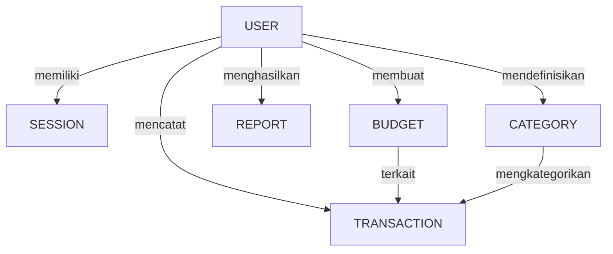

# BudgetApp Database Schema Documentation

## Overview

This document provides comprehensive documentation for the **BudgetApp** database schema built using PostgreSQL and Prisma. The schema supports personal finance management, including user authentication, budgets, transactions, categories, and reporting.

## Table of Contents

1. [Core Tables](#core-tables)
2. [User Management](#user-management)
3. [Budget System](#budget-system)
4. [Transaction Management](#transaction-management)
5. [Reporting](#reporting)
6. [Category Management](#category-management)
7. [Enums](#enums)
8. [Relationships](#relationships)
9. [Indexes & Constraints](#indexes--constraints)
10. [Performance & Best Practices](#performance--best-practices)
11. [ERD Graph (Diagram Entitas Hubungan)](#erd-graph-diagram-entitas-hubungan)

---

## Core Tables

### User
**Purpose:** Stores user account information and references related budgets, transactions, and reports.

| Column | Type | Description | Constraints |
|:---|:---|:---|:---|
| `id` | Int | Primary key | **PRIMARY KEY**, **AUTOINCREMENT** |
| `firstName` | String | User's first name | **NOT NULL** |
| `lastName` | String | User's last name | **NOT NULL** |
| `email` | String | User email address | **UNIQUE**, **NOT NULL** |
| `password` | String? | Hashed password | Nullable |
| `phoneNumber`| String? | User phone number | Nullable |
| `provider` | Provider | Authentication provider | **DEFAULT `local`** |
| `role` | Role | User role (user/admin) | **DEFAULT `user`** |
| `createdAt` | DateTime | Account creation timestamp | **DEFAULT NOW()** |
| `updatedAt` | DateTime | Last profile update | UPDATED automatically |

**Relationships:**
- One-to-many: `sessions`, `budgets`, `transactions`, `reports`, `categories`

---

## User Management

### Session
**Purpose:** Manages user login sessions for authentication and token tracking.

| Column | Type | Description | Constraints |
|:---|:---|:---|:---|
| `id` | String | Primary key | **PRIMARY KEY**, **CUID** |
| `userId` | Int | References `User.id` | **FOREIGN KEY**, **CASCADE ON DELETE** |
| `sid` | String | Unique session identifier | **UNIQUE** |
| `data` | String | Session data | **NOT NULL** |
| `expiresAt` | DateTime | Session expiration | **INDEXED** |
| `createdAt` | DateTime | Session creation timestamp | **DEFAULT NOW()** |
| `updatedAt`| DateTime | Last update | UPDATED automatically |

---

## Budget System

### Budget
**Purpose:** Tracks user-defined budgets.

| Column | Type | Description | Constraints |
|:---|:---|:---|:---|
| `id` | Int | Primary key | **PRIMARY KEY**, **AUTOINCREMENT** |
| `userId` | Int | References `User.id` | **FOREIGN KEY**, **CASCADE ON DELETE** |
| `title` | String | Budget title | **NOT NULL** |
| `category` | String? | Optional budget category | Nullable |
| `limitAmount` | Decimal | Budget limit amount | **NOT NULL** |
| `startDate` | DateTime?| Budget start date | Nullable |
| `endDate` | DateTime?| Budget end date | Nullable |
| `createdAt` | DateTime | Timestamp | **DEFAULT NOW()** |

**Relationships:**
- One-to-many: `transactions`

---

## Transaction Management

### Transaction
**Purpose:** Stores individual financial transactions.

| Column | Type | Description | Constraints |
|:---|:---|:---|:---|
| `id` | Int | Primary key | **PRIMARY KEY**, **AUTOINCREMENT** |
| `budgetId` | Int | References `Budget.id` | **FOREIGN KEY**, **CASCADE ON DELETE** |
| `userId` | Int | References `User.id` | **FOREIGN KEY**, **CASCADE ON DELETE** |
| `categoryId`| Int? | References `Category.id` | Nullable, **SET NULL ON DELETE** |
| `type` | TransactionType | Income or expense | **NOT NULL** |
| `amount` | Decimal | Transaction amount | **NOT NULL** |
| `description`| String? | Optional transaction description | Nullable |
| `date` | DateTime | Transaction date | **DEFAULT NOW()** |
| `createdAt` | DateTime | Timestamp | **DEFAULT NOW()** |

---

## Reporting

### Report
**Purpose:** Monthly financial summary per user.

| Column | Type | Description | Constraints |
|:---|:---|:---|:---|
| `id` | Int | Primary key | **PRIMARY KEY**, **AUTOINCREMENT** |
| `userId` | Int | References `User.id` | **FOREIGN KEY**, **CASCADE ON DELETE** |
| `month` | Int | Month of the report | **NOT NULL** |
| `year` | Int | Year of the report | **NOT NULL** |
| `totalIncome` | Decimal | Total income for the month| **DEFAULT 0** |
| `totalExpense`| Decimal | Total expense for the month| **DEFAULT 0** |
| `netBalance` | Decimal | Net balance | **DEFAULT 0** |
| `createdAt` | DateTime | Timestamp | **DEFAULT NOW()** |

---

## Category Management

### Category
**Purpose:** Stores custom categories for user transactions.

| Column | Type | Description | Constraints |
|:---|:---|:---|:---|
| `id` | Int | Primary key | **PRIMARY KEY**, **AUTOINCREMENT** |
| `userId` | Int | References `User.id` | **FOREIGN KEY**, **CASCADE ON DELETE** |
| `name` | String | Category name | **NOT NULL** |
| `type` | CategoryType | Income or expense | **DEFAULT `expense`** |
| `color` | String? | Optional color code | Nullable |
| `createdAt` | DateTime | Timestamp | **DEFAULT NOW()** |

---

## Enums

### Provider
- `local`
- `google`

### Role
- `user`
- `admin`

### TransactionType
- `income`
- `expense`

### CategoryType
- `income`
- `expense`

---

## Relationships

- **User → Session**: One-to-many
- **User → Budget**: One-to-many
- **User → Transaction**: One-to-many
- **User → Report**: One-to-many
- **User → Category**: One-to-many
- **Budget → Transaction**: One-to-many
- **Category → Transaction**: One-to-many (optional)

---

## Indexes & Constraints

- `Session.sid` indexed for faster lookup
- `Session.expiresAt` indexed for cleanup queries
- Unique constraints on `User.email`
- Foreign keys use `CASCADE` or `SET NULL` appropriately
- Composite index on `Report (userId, month, year)` for unique monthly reports (recommended addition)

---

## Performance & Best Practices

- Use batch inserts for **bulk transaction imports**
- Regularly archive old reports for performance
- Use database indexes on frequently queried columns (`userId`, `budgetId`, `categoryId`)
- Keep enum values consistent across application and database
- Utilize PostgreSQL's built-in date/time functions for time-series analysis (e.g., in reports)

---

## ERD Graph (Diagram Entitas Hubungan)

Diagram **Mermaid** ini memvisualisasikan Skema Database, menggunakan notasi **Crow's Foot** untuk hubungan, yang terlihat jauh lebih indah dan terstruktur daripada diagram teks biasa.

